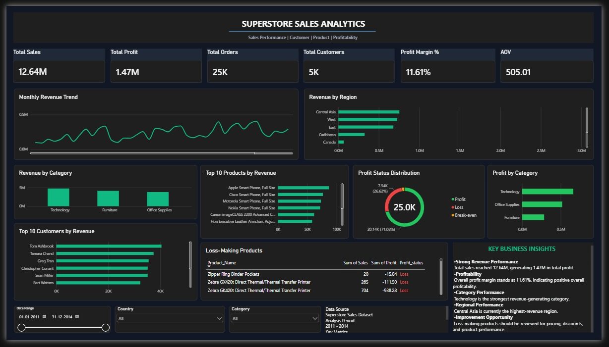

# Superstore Sales Analytics

## End-to-End Data Analytics Project | SQL + Power BI + DAX



---

## Project Overview

This is an end-to-end Data Analytics project built using the Superstore Sales Dataset.

The project started with exploring and analyzing the data using SQL Server. After performing the required business analysis, an analytical SQL view was created and connected to Power BI.

DAX measures were then created in Power BI to calculate important business KPIs such as Total Sales, Total Profit, Total Orders, Total Customers, Profit Margin, and Average Order Value.

The final result is an interactive Power BI dashboard that provides insights into sales performance, profitability, customers, products, categories, and regional performance.

---

## Project Workflow

The complete project workflow was:

**Raw Data → SQL Server → SQL Analysis → Analytical SQL View → Power BI → DAX Measures → Dashboard → Business Insights**

---

## Business Objective

The main objective of this project is to analyze sales and profitability performance and identify important business trends and areas that may require attention.

The analysis focuses on:

- Overall sales performance
- Profitability
- Order performance
- Customer performance
- Product performance
- Category performance
- Regional performance
- Monthly revenue trends
- Loss-making products

---

# 1. SQL Analysis

The first stage of the project was completed using SQL Server.

SQL was used to explore the dataset, analyze sales performance, calculate business metrics, study customers and products, and prepare the data required for Power BI.

### SQL Analysis Areas

- Total Sales
- Total Profit
- Total Orders
- Total Customers
- Revenue by Region
- Revenue by Category
- Top Products
- Top Customers
- Monthly Revenue
- Average Order Value
- Profitability Analysis
- Loss-making Products

### SQL Skills Used

- SELECT
- WHERE
- GROUP BY
- ORDER BY
- HAVING
- Aggregate Functions
- DISTINCTCOUNT logic
- CASE statements
- JOINs
- Date Functions
- Subqueries
- Common Table Expressions (CTEs)
- Window Functions
- Ranking
- Business-focused SQL analysis

---

# 2. Analytical SQL View

After analyzing the data, an analytical SQL view was created to provide a clean dataset for Power BI.

The view contains the required information for dashboard analysis, including:

- Order information
- Customer information
- Product information
- Sales
- Profit
- Region
- Country
- Category
- Order Date
- Profit Status

Creating the analytical view helped separate the SQL/data preparation layer from the Power BI reporting layer.

---

# 3. Power BI Connection

The analytical SQL view was connected to Power BI.

Power BI was then used to build the reporting and visualization layer of the project.

The dashboard was designed as a single-page business performance dashboard.

---

# 4. DAX Measures

DAX was used to create the main KPIs displayed in the dashboard.

## Total Sales

```DAX
Total Sales = SUM(vw_superstore_analysis[Sales])
```

Calculates the total sales generated from the dataset.

---

## Total Profit

```DAX
Total Profit = SUM(vw_superstore_analysis[Profit])
```

Calculates the total profit generated.

---

## Total Orders

```DAX
Total Orders = DISTINCTCOUNT(vw_superstore_analysis[Order_ID])
```

Counts the number of unique orders.

DISTINCTCOUNT is used because a single order can contain multiple records.

---

## Total Customers

```DAX
Total Customers = DISTINCTCOUNT(vw_superstore_analysis[Customer_ID])
```

Counts the number of unique customers.

---

## Profit Margin %

```DAX
Profit Margin % = DIVIDE([Total Profit], [Total Sales], 0)
```

Calculates profit as a percentage of total sales.

**Profit Margin = Total Profit / Total Sales**

---

## Average Order Value

```DAX
AOV = DIVIDE([Total Sales], [Total Orders], 0)
```

Calculates the average sales value generated per order.

**AOV = Total Sales / Total Orders**

---

# 5. Power BI Dashboard

## SUPERSTORE SALES ANALYTICS

The final dashboard provides a complete overview of:

- Sales Performance
- Customer Performance
- Product Performance
- Profitability

### Dashboard KPIs

| KPI | Value |
|---|---:|
| Total Sales | 12.64M |
| Total Profit | 1.47M |
| Total Orders | 25K |
| Total Customers | 5K |
| Profit Margin | 11.61% |
| AOV | 505.01 |

---

# 6. Dashboard Visuals

### Monthly Revenue Trend

Shows how revenue changes over the analysis period and helps identify changes in monthly sales performance.

### Revenue by Region

Shows revenue generated across different regions and helps identify the strongest regional markets.

### Revenue by Category

Compares revenue generated by the major product categories.

Technology is currently the strongest revenue-generating category shown in the dashboard.

### Top 10 Products by Revenue

Shows the highest-revenue products and helps identify products that contribute significantly to total sales.

### Top 10 Customers by Revenue

Shows the customers generating the highest revenue and helps identify high-value customers.

### Profit Status Distribution

Shows the distribution of orders across:

- Profit
- Loss
- Break-even

### Profit by Category

Compares profit performance across the major product categories.

### Loss-Making Products

Shows products that generated negative profit.

These products can be investigated further based on:

- Pricing
- Discounts
- Product costs
- Sales strategy
- Product performance

---

# 7. Interactive Filters

The dashboard contains interactive filters for:

- Date Range
- Country
- Category

These filters allow users to explore the dashboard dynamically.

---

# 8. Key Business Insights

### Strong Revenue Performance

Total sales reached approximately **12.64M**, generating approximately **1.47M** in total profit.

### Profitability

Overall profit margin stands at approximately **11.61%**, indicating positive overall profitability.

### Category Performance

Technology is the strongest revenue-generating category in the current dashboard analysis.

### Regional Performance

Central Asia is currently the highest-revenue region shown in the dashboard.

### Improvement Opportunity

Loss-making products should be reviewed further to understand the impact of pricing, discounts, costs, and product performance.

---

# 9. Tools Used

### SQL Server

Used for:

- Data exploration
- Business analysis
- Aggregations
- Filtering
- Customer analysis
- Product analysis
- Creating the analytical SQL view

### Power BI

Used for:

- Connecting to the SQL analytical view
- Dashboard development
- Data visualization
- Interactive filtering
- Business reporting

### DAX

Used for:

- KPI calculations
- Total Sales
- Total Profit
- Total Orders
- Total Customers
- Profit Margin
- Average Order Value

### GitHub

Used for:

- Project documentation
- Version control
- Portfolio presentation

---
## 10. Project Structure

Superstore-Sales-Analytics/
│
├── README.md
├── LICENSE
├── dashboard.image.jpg
│
└── sql/
    ├── analysis.sql
    └── view.sql

---

# 11. End-to-End Approach

### Step 1 — Understand the Data

The Superstore dataset was explored to understand the available sales, customer, product, region, and profitability information.

### Step 2 — Analyze Using SQL

SQL Server was used to perform business-focused analysis and calculate the required metrics.

### Step 3 — Create Analytical View

An analytical SQL view was created to provide a clean dataset for Power BI.

### Step 4 — Connect to Power BI

The SQL view was connected to Power BI.

### Step 5 — Create DAX Measures

DAX measures were created for the main dashboard KPIs.

### Step 6 — Build Dashboard

The Power BI dashboard was designed to present sales, profit, customer, product, category, and regional performance.

### Step 7 — Extract Business Insights

The final dashboard was used to identify important business findings and potential improvement areas.

---

# 12. What I Learned

This project helped me practice the complete workflow of a Data Analyst project.

### SQL

I learned how to:

- Analyze business data using SQL
- Write aggregation queries
- Work with customers and products
- Analyze revenue and profitability
- Create SQL views
- Prepare data for reporting

### Power BI

I learned how to:

- Connect Power BI to SQL
- Build KPI cards
- Create charts and tables
- Use slicers
- Design a dashboard
- Create interactive reports

### DAX

I learned how to:

- Create measures
- Use SUM
- Use DISTINCTCOUNT
- Use DIVIDE
- Build reusable KPI calculations
- Create profitability metrics

### Data Analysis

Most importantly, I learned how to move from raw data to business insights instead of simply creating visualizations.

---

# 13. Business Value

This project demonstrates how raw sales data can be transformed into a useful business reporting solution.

The final dashboard can help a business understand:

- Where revenue is coming from
- Which categories perform best
- Which products generate the most revenue
- Which customers generate the most revenue
- Which regions perform strongly
- How profitable the business is
- Which products are generating losses

---

# 14. Future Improvements

Possible future improvements include:

- Year-over-year growth analysis
- Monthly profit trends
- Customer segmentation
- Product profitability ranking
- Customer retention analysis
- Drill-through pages
- Tooltip pages
- Advanced DAX calculations
- Automated data refresh
- Additional business KPIs

---

# Author

**Muthukumar**

Aspiring Data Analyst

**Skills:** SQL | Excel | Power BI | DAX | Data Analysis

---

## Project Summary

**Superstore Sales Analytics** is an end-to-end Data Analytics project demonstrating how SQL Server, Power BI, and DAX can be combined to transform sales data into meaningful business insights.

**SQL → Analytical View → Power BI → DAX → Dashboard → Business Insights**
